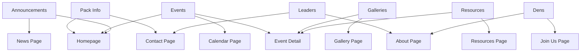

# Data Model: Pack 3472 Website

**Date**: 2025-10-26  
**Feature**: Pack 3472 Cub Scout Website Redesign  
**Purpose**: Define content structure and data entities for static website

## Overview

This data model defines the content entities for the Pack 3472 website. Since this is a static Jekyll site, entities are represented as:

- YAML/JSON data files in `_data/` directory
- Markdown files with YAML front matter in collections (e.g., `_posts/`, `_events/`)
- Configuration in `_config.yml`

---

## Core Entities

### 1. Pack Information

**Purpose**: Basic pack identity and details displayed throughout the site

**Location**: `_data/pack-info.yml`

**Schema**:

```yaml
pack_number: 3472
pack_name: 'Pack 3472'
chartered_organization: 'Lincoln Elementary School PTA'
council: 'Great Rivers Council'
district: 'Pioneer District'

meeting_info:
  day: 'Tuesday'
  time: '6:30 PM - 7:30 PM'
  location:
    name: 'Lincoln Elementary School'
    address: '123 Main Street'
    city: 'Springfield'
    state: 'IL'
    zip: '62701'
    google_maps_url: 'https://goo.gl/maps/...'

contact:
  email: 'info@pack3472.org'
  phone: '(555) 123-4567'
  facebook: 'https://facebook.com/pack3472'
  instagram: 'pack3472'

membership:
  ages: 'Kindergarten - 5th Grade'
  grade_levels: ['K', '1', '2', '3', '4', '5']
  ranks: ['Lion', 'Tiger', 'Wolf', 'Bear', 'Webelos', 'Arrow of Light']

fees:
  registration: '$100'
  uniform: '$40-60'
  handbook: '$15'
  additional_activities: 'Varies by event'
  payment_info: 'Checks payable to Pack 3472'
```

**Validation Rules**:

- `pack_number`: Required, integer
- `meeting_info.day`: Required, one of weekday names
- `contact.email`: Required, valid email format
- `contact.phone`: Required, phone format
- All location fields required

**Usage**:

- Homepage hero section
- Contact page
- Join Us page
- Footer (every page)

---

### 2. Leadership Roster

**Purpose**: Display pack leadership team

**Location**: `_data/leaders.yml`

**Schema**:

```yaml
leaders:
  - name: 'John Smith'
    role: 'Cubmaster'
    email: 'cubmaster@pack3472.org'
    photo: '/assets/images/leaders/john-smith.jpg'
    bio: 'John has been with Pack 3472 for 5 years...'
    order: 1

  - name: 'Jane Doe'
    role: 'Committee Chair'
    email: 'committee@pack3472.org'
    photo: '/assets/images/leaders/jane-doe.jpg'
    bio: 'Jane brings organizational expertise...'
    order: 2

  - name: 'Mike Johnson'
    role: 'Den Leader - Tigers'
    email: 'tigers@pack3472.org'
    photo: '/assets/images/leaders/mike-johnson.jpg'
    den: 'Tigers'
    order: 3
```

**Validation Rules**:

- `name`: Required, string
- `role`: Required, one of defined roles
- `email`: Required, valid email
- `photo`: Optional, path to image
- `order`: Required, integer (for display order)

**Defined Roles**:

- Cubmaster
- Committee Chair
- Den Leader
- Treasurer
- Advancement Chair
- Activities Chair
- Membership Chair

**Usage**:

- About Us page
- Contact page (show relevant leader per inquiry type)

---

### 3. Den Information

**Purpose**: Details about each den (age group)

**Location**: `_data/dens.yml`

**Schema**:

```yaml
dens:
  - rank: 'Lion'
    grade: 'Kindergarten'
    age: '5-6 years'
    color: '#FDB913' # Gold
    meeting_day: 'Saturday'
    meeting_time: '10:00 AM'
    den_leader: 'Sarah Williams'
    description: 'Our youngest scouts explore fun adventures...'
    active: true

  - rank: 'Tiger'
    grade: '1st Grade'
    age: '6-7 years'
    color: '#FF6B35' # Orange
    meeting_day: 'Wednesday'
    meeting_time: '4:00 PM'
    den_leader: 'Mike Johnson'
    description: 'Tigers learn about teamwork...'
    active: true

  - rank: 'Wolf'
    grade: '2nd Grade'
    age: '7-8 years'
    color: '#00843D' # Green
    meeting_day: 'Monday'
    meeting_time: '6:30 PM'
    den_leader: 'Tom Brown'
    description: 'Wolves develop outdoor skills...'
    active: true
```

**Validation Rules**:

- `rank`: Required, one of Cub Scout ranks
- `grade`: Required, K-5
- `active`: Required, boolean
- All fields required if den is active

**Usage**:

- About page (ranks overview)
- Join Us page (help parents identify child's rank)
- Homepage (visual rank showcase)

---

### 4. Event

**Purpose**: Pack activities, meetings, campouts

**Location**: `_events/` collection (Markdown files with front matter)

**File naming**: `YYYY-MM-DD-event-slug.md`

**Front Matter Schema**:

```yaml
---
title: "Fall Campout 2024"
date: 2024-10-15
start_time: "Friday 6:00 PM"
end_time: "Sunday 11:00 AM"
event_type: "campout"
location:
  name: "Camp Big Sky"
  address: "456 Forest Road"
  city: "Oakville"
  state: "IL"
  google_maps_url: "https://goo.gl/maps/..."
rsvp_required: true
rsvp_deadline: 2024-10-08
contact_leader: "John Smith"
cost: "$25 per scout"
what_to_bring:
  - "Sleeping bag"
  - "Warm clothes"
  - "Water bottle"
  - "Flashlight"
tags: ["campout", "outdoor", "overnight"]
featured_image: "/assets/images/events/fall-campout-2024.jpg"
---

Join us for our annual fall campout! We'll enjoy hiking, campfire songs,
outdoor cooking, and stargazing. This is a family event - siblings welcome!

## Schedule

**Friday Evening:**
- 6:00 PM: Arrival and setup
- 7:00 PM: Campfire program
- 9:00 PM: Lights out

**Saturday:**
- 8:00 AM: Breakfast
- 9:00 AM: Hiking and outdoor skills
- 12:00 PM: Lunch
- 2:00 PM: Free time / games
- 6:00 PM: Dinner
- 7:30 PM: Campfire and s'mores
- 9:00 PM: Lights out

**Sunday:**
- 8:00 AM: Breakfast
- 9:00 AM: Camp cleanup
- 10:00 AM: Closing ceremony
- 11:00 AM: Departure

## Forms Required
- [Campout Permission Slip](https://drive.google.com/...)
```

**Validation Rules**:

- `title`: Required, string
- `date`: Required, YYYY-MM-DD format
- `event_type`: Required, one of defined types
- `location.name`: Required for in-person events
- `rsvp_deadline`: Optional, must be before event date

**Event Types**:

- pack_meeting
- den_meeting
- campout
- service_project
- fundraiser
- field_trip
- pinewood_derby
- blue_and_gold
- crossover
- family_event

**Usage**:

- Calendar page (list and calendar views)
- Homepage (upcoming events)
- Event detail pages
- iCal export

---

### 5. Announcement/News

**Purpose**: Time-sensitive communications and pack news

**Location**: `_posts/` collection (Jekyll default)

**File naming**: `YYYY-MM-DD-announcement-slug.md`

**Front Matter Schema**:

```yaml
---
title: 'Pack Meeting Cancelled - October 10'
date: 2024-10-08
author: 'John Smith'
categories: [announcement]
tags: [cancellation, weather]
priority: high
expiration_date: 2024-10-11
featured: true
---
Due to severe weather warnings, tonight's pack meeting (October 10) is
cancelled. We will resume our regular schedule next week.

Stay safe and we'll see you soon!
```

**Validation Rules**:

- `title`: Required, string
- `date`: Required, publish date
- `priority`: Optional, one of: low, normal, high, urgent
- `expiration_date`: Optional, removes from "current" list after this date

**Priority Levels**:

- `urgent`: Red banner, homepage featured
- `high`: Yellow highlight, homepage featured
- `normal`: Default styling
- `low`: Muted styling

**Usage**:

- Homepage (recent announcements)
- News/Announcements page (all announcements)
- RSS feed

---

### 6. Photo Gallery/Album

**Purpose**: Organize photos from pack events

**Location**: `_data/galleries.yml` or `_galleries/` collection

**Schema**:

```yaml
galleries:
  - id: 'fall-campout-2024'
    title: 'Fall Campout 2024'
    date: 2024-10-15
    event_ref: 'fall-campout-2024' # Reference to event
    description: 'Photos from our amazing fall campout!'
    cover_image:
      url: 'https://res.cloudinary.com/pack3472/image/upload/v1/campout-cover.jpg'
      alt: 'Scouts around campfire'
    photos:
      - url: 'https://res.cloudinary.com/pack3472/image/upload/v1/campout-01.jpg'
        alt: 'Scouts hiking on trail'
        caption: 'Morning hike through the forest'
      - url: 'https://res.cloudinary.com/pack3472/image/upload/v1/campout-02.jpg'
        alt: 'Campfire activities'
        caption: 'Evening campfire songs'
    published: true
    featured: false
```

**Photo Schema**:

```yaml
url: 'https://res.cloudinary.com/pack3472/image/upload/...'
alt: 'Description for accessibility'
caption: 'Optional caption for context'
date_taken: 2024-10-15 # Optional
photographer: 'Jane Doe' # Optional, credit
```

**Validation Rules**:

- `id`: Required, unique slug
- `title`: Required, string
- `cover_image.url`: Required
- `cover_image.alt`: Required (accessibility)
- Each photo must have `url` and `alt`

**Privacy Rules**:

- No full names in captions
- No identifying information
- Only use first names or "scouts"
- Follow BSA youth protection guidelines

**Usage**:

- Gallery page (list of albums)
- Album detail pages
- Event pages (link to related gallery)
- Homepage (featured gallery)

---

### 7. Document/Resource

**Purpose**: Forms, handbooks, calendars for download

**Location**: `_data/resources.yml`

**Schema**:

```yaml
resources:
  - category: 'forms'
    title: 'Campout Permission Slip'
    description: 'Required for all overnight campouts'
    file_url: 'https://drive.google.com/file/d/...'
    file_type: 'PDF'
    file_size: '250 KB'
    updated_date: 2024-09-01
    required_for: ['campout']

  - category: 'handbooks'
    title: 'Pack 3472 Parent Guide'
    description: 'Everything parents need to know'
    file_url: 'https://drive.google.com/file/d/...'
    file_type: 'PDF'
    file_size: '2 MB'
    updated_date: 2024-08-15

  - category: 'calendar'
    title: '2024-2025 Pack Calendar'
    description: 'Full year schedule'
    file_url: 'https://drive.google.com/file/d/...'
    file_type: 'PDF'
    file_size: '500 KB'
    ical_url: 'https://calendar.google.com/calendar/ical/...'
    updated_date: 2024-08-01
```

**Categories**:

- forms
- handbooks
- calendars
- policies
- fundraising
- advancement

**Validation Rules**:

- `category`: Required, one of defined categories
- `title`: Required, string
- `file_url`: Required, valid URL
- `file_type`: Required, uppercase extension
- `updated_date`: Required, YYYY-MM-DD

**Usage**:

- Resources page (organized by category)
- Event pages (link required forms)
- Join Us page (link relevant forms)

---

## Site Configuration

**Location**: `_config.yml`

**Schema**:

```yaml
# Site Settings
title: 'Pack 3472'
description: 'Cub Scouts Pack 3472 - Springfield, IL'
baseurl: ''
url: 'https://pack3472.org'

# Contact
email: info@pack3472.org
phone: '(555) 123-4567'

# Social Media
facebook: pack3472
instagram: pack3472

# Google Integration
google_calendar_id: 'YOUR_CALENDAR_ID@group.calendar.google.com'
google_drive_folder: 'PUBLIC_FOLDER_ID'

# Build Settings
theme: minimal-mistakes
plugins:
  - jekyll-feed
  - jekyll-seo-tag
  - jekyll-sitemap
  - jekyll-paginate

# Collections
collections:
  events:
    output: true
    permalink: /events/:year/:month/:day/:title/
  galleries:
    output: true
    permalink: /gallery/:title/

# Defaults (front matter defaults for collections)
defaults:
  - scope:
      path: ''
      type: 'posts'
    values:
      layout: 'post'
      author: 'Pack 3472'
  - scope:
      path: ''
      type: 'events'
    values:
      layout: 'event'
  - scope:
      path: ''
      type: 'galleries'
    values:
      layout: 'gallery'
```

---

## Content Relationships



**Key Relationships**:

- Events can reference Galleries (photos from event)
- Events can reference Resources (required forms)
- Galleries can reference Events (photos from which event)
- Leaders are associated with Dens
- Announcements can reference Events

---

## Content Workflow

### Creating New Content

**New Event**:

1. Leader logs into Netlify CMS
2. Navigates to "Events" collection
3. Clicks "New Event"
4. Fills in form fields
5. Saves as draft (optional review)
6. Publishes → Creates Git commit → Triggers rebuild

**New Announcement**:

1. Navigate to "Announcements"
2. Click "New Announcement"
3. Fill in form
4. Set priority if urgent
5. Publish → Git commit → Site rebuild

**Upload Photos**:

1. Upload to Cloudinary (via web interface or API)
2. Create new Gallery in Netlify CMS
3. Add Cloudinary URLs and alt text
4. Organize photos with captions
5. Publish

**Update Resources**:

1. Upload new file to Google Drive
2. Get shareable link (view-only)
3. Edit `_data/resources.yml` in Netlify CMS
4. Update file URL and updated_date
5. Publish

### Content Review Process

**Optional Editorial Workflow** (Netlify CMS feature):

1. Editor creates content, saves as "Draft"
2. Reviewer receives notification
3. Reviewer previews content
4. Reviewer approves or requests changes
5. Once approved, publish to main branch

---

## Migration from Existing Site

**Data to Migrate**:

1. Current pack information (verify accuracy)
2. Leadership roster (update photos if needed)
3. Recent events (last 6 months)
4. Active announcements
5. Existing photo galleries
6. Current documents/forms

**Migration Process**:

1. Audit existing content
2. Clean up outdated information
3. Convert to new format (manual or scripted)
4. Upload photos to Cloudinary
5. Move documents to Google Drive
6. Create YAML data files
7. Create Markdown files for events/announcements
8. Review and test

---

## Content Guidelines

### Writing Style

- **Tone**: Friendly, enthusiastic, inclusive
- **Voice**: Active voice, second person ("you")
- **Readability**: Short paragraphs, bullet lists, clear headings
- **Audience**: Parents (decision-makers) and kids (influencers)

### SEO Best Practices

- Descriptive page titles (include "Pack 3472")
- Meta descriptions for key pages
- Alt text for all images
- Semantic heading structure (H1 → H2 → H3)
- Internal linking
- Keyword optimization (local SEO)

### Accessibility Requirements

- Alt text describes image content, not "image of..."
- Link text is descriptive (not "click here")
- Headings used for structure, not styling
- Lists used for list content
- Form labels associated with inputs
- Color not sole indicator of meaning

### Youth Protection

- ✅ First names only (or "Scout", "our scouts")
- ❌ Never full names
- ❌ Never addresses or phone numbers of scouts
- ❌ No identifying information in photos
- ✅ Group photos preferred over individuals
- ✅ Activity-focused, not face-focused

---

## Maintenance Schedule

**Weekly**:

- Publish new announcements as needed
- Update event details if changes
- Upload photos from recent events

**Monthly**:

- Review upcoming events for accuracy
- Archive old announcements (past expiration)
- Update resource documents if needed
- Check for broken links

**Quarterly**:

- Update leadership roster
- Review den information
- Audit Google Drive permissions
- Update pack calendar

**Annually**:

- Complete content audit
- Update pack information
- Refresh photos and galleries
- Update handbooks and forms
- Review and update fees

---

## Success Metrics

**Content Health**:

- Events posted at least 2 weeks in advance
- Announcements current (none expired)
- Photo galleries updated within 1 week of events
- Resources updated within 24 hours of changes
- No broken links or missing images

**Engagement**:

- Homepage views
- Event page views
- Calendar interactions
- Resource downloads
- Contact form submissions
- Average time on site

---

## Next Steps

1. ✅ Data model defined
2. → Create contracts for Google integrations
3. → Generate quickstart guide
4. → Set up repository with sample data
5. → Configure Netlify CMS with this schema
